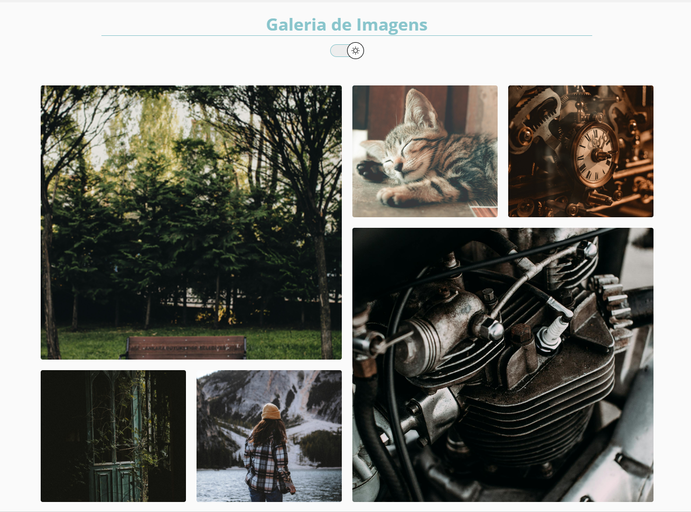

<h1 align="center"> Galeria de Imagens </h1>

  <a href="#-tecnologias">Tecnologias</a>&nbsp;&nbsp;&nbsp;|&nbsp;&nbsp;&nbsp;
  <a href="#-projeto">Projeto</a>

  

 

## 🚀 Tecnologias

Esse projeto foi desenvolvido com as seguintes tecnologias:

- HTML e CSS
- Javascript

## 💻 Projeto

Projeto de uma galeria de imagens para a disciplina de Desenvolvimento Web.
